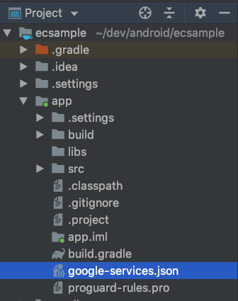

# CRE Sample Application

## Introduction

This repo demonstrates how to setup and use Repro SDK using familliar subject(Ecommerce). 

It basically explains the following functionalities:
 - SDK setup
 
 - Event tracking 
 
 - User profile

 - Webview

 - Push notification
 
 - InApp messaging

## Getting started

This app mainly consists of the four screens:  

 - Splash screen

 - Home Screen
 
 - Detail screen

 - Cart screen

 - Webview screen

## Screen transition

## google-services.json

This app will not work unless google-service.json is stored in the app folder that has been switched to project display.
Please check the link below for instructions on creating google-service.json.
https://docs.repro.io/en/dev/sdk/push-notification/setup-android.html#fcm-android

The android package name for this app is "com.company.ecsample".